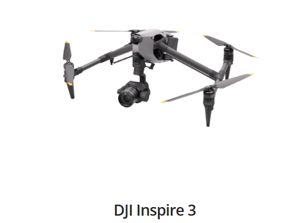
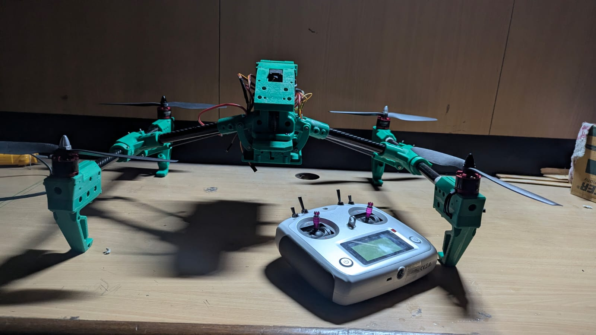
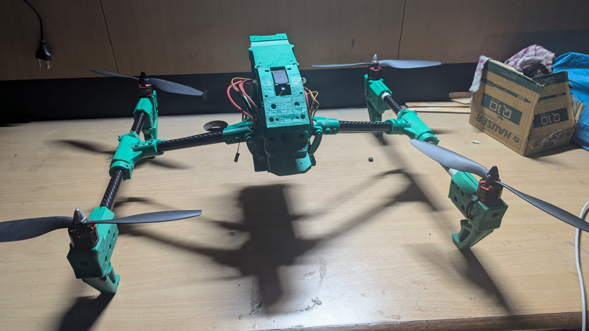
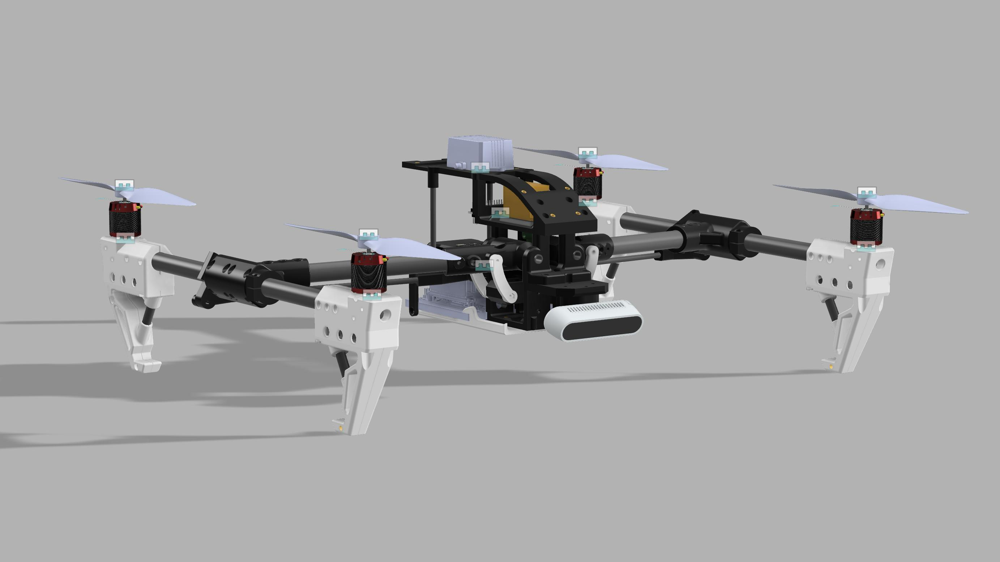
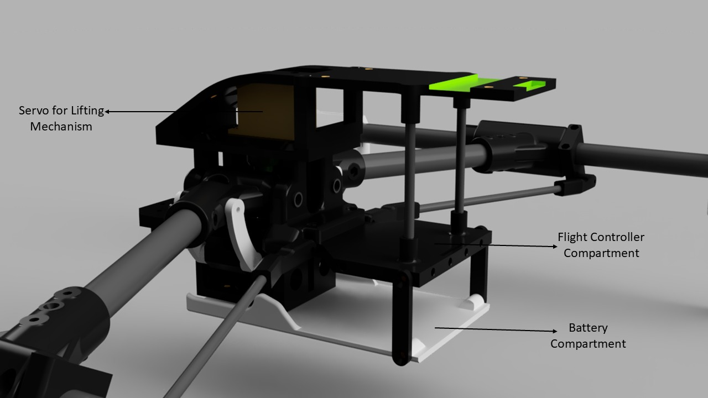
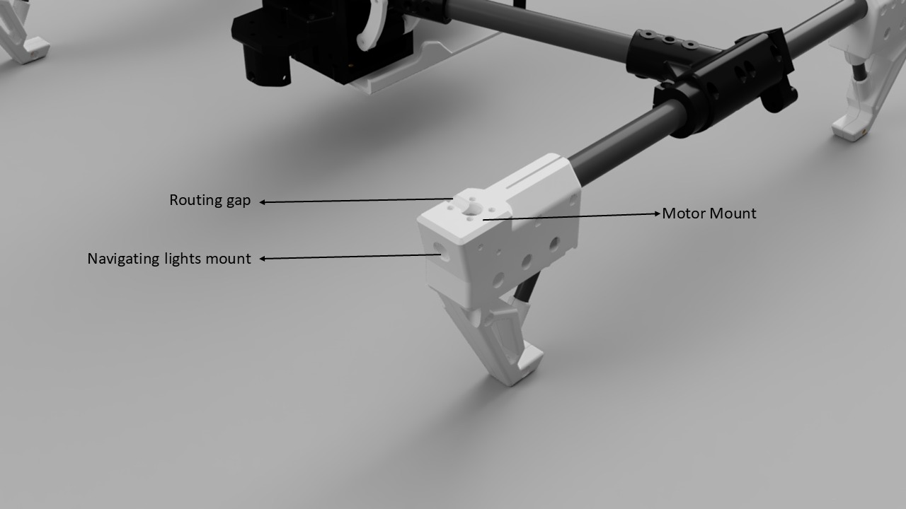
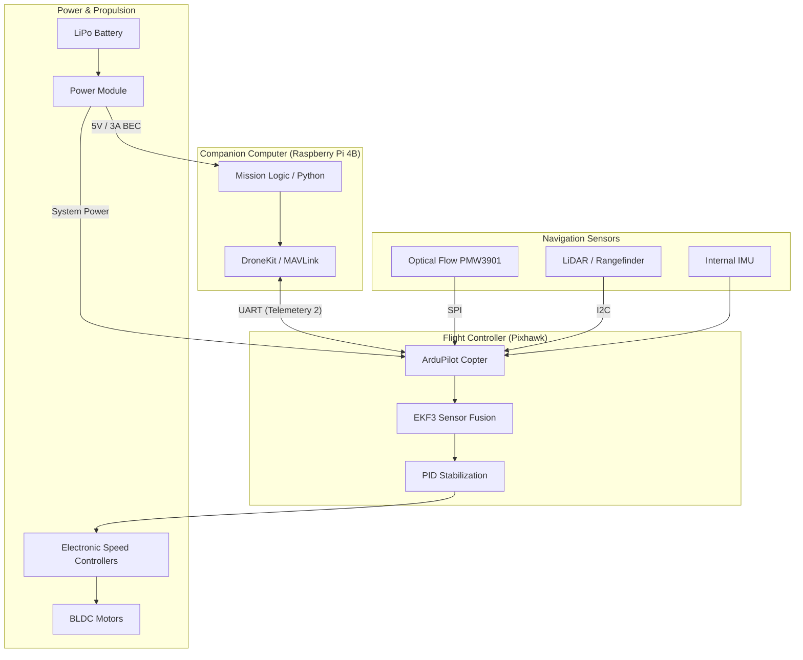

# GPS-Denied Autonomous Drone Control System

[](https://opensource.org/licenses/MIT)
[](https://www.python.org/downloads/)
[](https://www.isro.gov.in/)

Autonomous drone navigation and stabilization system designed for environments where GPS is unavailable. Developed for the **ISRO IRoC-2025 Challenge**, this project leverages sensor fusion and PID control to achieve stable flight in GPS-denied scenarios.

---

## 🚀 Overview

This project enables a quadcopter to perform autonomous **takeoff, hover, drift correction, and smart landing** without relying on external positioning systems. 

The system uses onboard sensors (Optical Flow, IMU, Rangefinder) to estimate position and velocity, providing a robust solution for indoor inspections, warehouse automation, and extraterrestrial exploration analogs.

### Core Technologies
- **Control:** Custom PID Loops for Altitude, Roll, and Pitch.
- **Sensing:** Optical Flow (Drift), Rangefinder (Altitude), IMU (Attitude).
- **Platform:** Pixhawk Flight Controller + Raspberry Pi Companion Computer.
- **Software:** Python, DroneKit, MAVLink.

---

## 📄 Project Documentation

For a deep dive into the mechanical and electrical analysis, please refer to our formal proposal:
👉 **[Full Project Proposal & Technical Report](https://drive.google.com/file/d/1DtLQk2ciU6UJ7kkSxyrs7WJx4UHbMjwY/view?usp=drive_link)**

---

## ✨ Key Features

- ✅ **Autonomous State Management:** Modular `DroneController` class for scalable mission planning.
- ✅ **GPS-Denied Stability:** Real-time drift compensation using Optical Flow.
- ✅ **Smart Landing:** Controlled descent with horizontal stabilization for safe touchdown.
- ✅ **Safety First:** Integrated failsafes for sensor loss and emergency landing.
- ✅ **Telemetry Logging:** Detailed logging for post-flight analysis.

---

## 🏗 Mechanical Design

The drone's structural design is inspired by the **DJI Inspire series**, featuring a robust and aerodynamic aesthetic optimized for 3D printing.

### Design Evolution
| Reference: DJI Inspire 3 | Team Astroforge Prototype | H-Arm Joint Detail |
| :---: | :---: | :---: |
|  |  |  |

### CAD Design & Internal Layout
The drone's internal architecture is meticulously planned for component protection and optimal weight distribution.

| Full CAD Assembly | Internal Compartments | Motor Mount & Routing Detail |
| :---: | :---: | :---: |
|  |  |  |

### H-Arm Mechanism
The frame incorporates a specialized **Lead Screw based adjustable H-arm joint** system. This mechanism is designed to provide the UAV with a stable landing platform on inclinations of up to **15 degrees**, ensuring operational versatility in rugged terrains.

#### 🎥 Arm Movement Demo (Initial Testing)
<video src="https://raw.githubusercontent.com/laksh890/GPS-Denied-Autonomous-Drone-ISRO---IRoC-2025-Challenge-/main/assets/videos/arm_movement.mp4" muted autoplay loop width="500" height="350"></video>

---

## 📹 Flight Testing & Evolution

The development process involved iterative testing, progressing from mechanical stability to fully autonomous sensor fusion.

### 1. H-Bridge UAV: First Remote Operated Flight Test
Testing the structural integrity and flight characteristics of the 3D-printed H-bridge frame.
<video src="https://raw.githubusercontent.com/laksh890/GPS-Denied-Autonomous-Drone-ISRO---IRoC-2025-Challenge-/main/assets/videos/hbridge_flight_test.mp4" muted autoplay loop width="500" height="350"></video>

### 2. Semi-Stable PID Control (Autonomous)
Initial autonomous testing on an X-frame drone using barometer for altitude and accelerometer for drift correction.
<video src="https://raw.githubusercontent.com/laksh890/GPS-Denied-Autonomous-Drone-ISRO---IRoC-2025-Challenge-/main/assets/videos/semistable_pid_test.mp4" muted autoplay loop width="500" height="350"></video>

### 3. Fully Stable Autonomous PID Algorithm
Advanced testing with sensor fusion (Optical Flow for drift and LiDAR ToF for precision altitude control) on the X-frame platform.
<video src="https://raw.githubusercontent.com/laksh890/GPS-Denied-Autonomous-Drone-ISRO---IRoC-2025-Challenge-/main/assets/videos/autonomous_flight_test.mp4" muted autoplay loop width="500" height="350"></video>

### 🏆 Final Submission Showcase
Watch the final mission with all failsafes and autonomous systems in action:
[](https://youtu.be/tSXcJss_m8Q)

---

## 🛠 Hardware Requirements

- **Flight Controller:** Pixhawk 2.4.8 (or any ArduPilot compatible FC).
- **Companion Computer:** Raspberry Pi 4B / Jetson Nano.
- **Sensors:**
  - Optical Flow Sensor (e.g., PMW3901).
  - LiDAR / Ultrasonic Rangefinder (e.g., TF-Luna, VL53L1X).
- **Frame:** 450mm - 250mm Quadcopter.

---

## 🔌 System Architecture

The project employs a dual-processor architecture for robust autonomous control in GPS-denied environments.

### Logical Circuit Architecture



### Wiring & Communication
- **UART Interface**: The Raspberry Pi communicates with the Pixhawk via the `TELEM2` port at a baud rate of `921600`.
- **Sensing Fusion**: The Pixhawk's EKF3 algorithm fuses data from the **Optical Flow** (SPI) for X-Y drift compensation and the **LiDAR** (I2C) for precision altitude maintenance.
- **Fail-Safe**: The architecture includes heartbeat monitoring; if the Raspberry Pi (companion computer) fails, the Pixhawk is configured to RTL or Land based on the onboard failsafe logic.

---

## 💻 Getting Started

### Prerequisites
- Python 3.9 or higher.
- ArduPilot Firmware (Copter 4.0+) installed on the FC.

### Installation
1. Clone the repository:
   ```bash
   git clone https://github.com/laksh890/GPS-Denied-Autonomous-Drone-ISRO---IRoC-2025-Challenge-.git
   cd GPS-Denied-Autonomous-Drone-ISRO---IRoC-2025-Challenge-
   ```

2. Install dependencies:
   ```bash
   pip install -r requirements.txt
   ```

### Running the System
Connect your companion computer to the Pixhawk via UART/USB and run:
```bash
python src/main.py --connect /dev/ttyACM0
```

---

## 📈 Future Roadmap

- [ ] **ArUco Marker Precision Landing:** Visual docking for battery replacement.
- [ ] **Obstacle Avoidance:** Integration of 360-degree LiDAR.
- [ ] **SLAM Navigation:** Simultaneous Localization and Mapping for complex environments.
- [ ] **ROS2 Support:** Porting the core logic to a ROS2 workspace.

---

## 🤝 Contributing

We welcome contributions! Whether it's a bug fix, feature request, or documentation improvement, please check out our [CONTRIBUTING.md](CONTRIBUTING.md) for guidelines.

---

## 📁 Project Structure

```text
gps-denied-drone/
├── src/
│   ├── controllers/
│   │   └── pid.py          # Core PID control logic
│   ├── drone/
│   │   ├── controller.py   # High-level Drone Class (NEW)
│   │   ├── connection.py   # MAVLink connection management
│   │   ├── mission.py      # Mission state logic
│   │   ├── failsafe.py     # Safety protocols
│   │   └── rc.py           # RC Override utilities
│   ├── config.py           # Tuning parameters & constants
│   └── main.py             # Entry point
├── docs/                   # Documentation & diagrams
├── LICENSE                 # MIT License
└── README.md               # You are here
```

---

## 📜 License

This project is licensed under the MIT License - see the [LICENSE](LICENSE) file for details.

---

## 🏆 Acknowledgements

- **ISRO** for the IRoC-2025 Challenge opportunity.
- **ArduPilot & DroneKit** communities for the robust infrastructure.